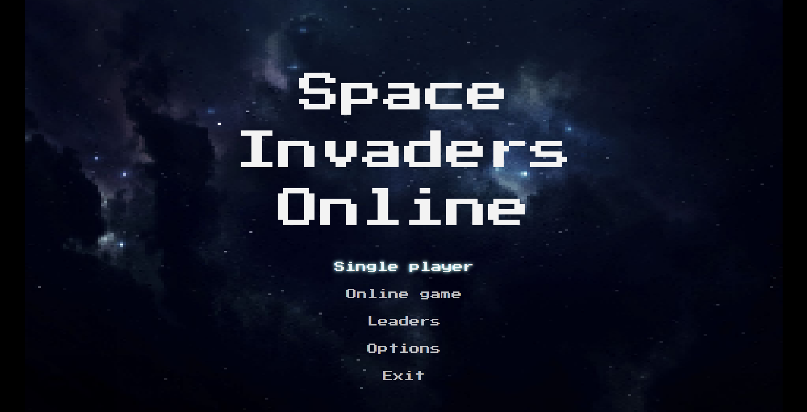
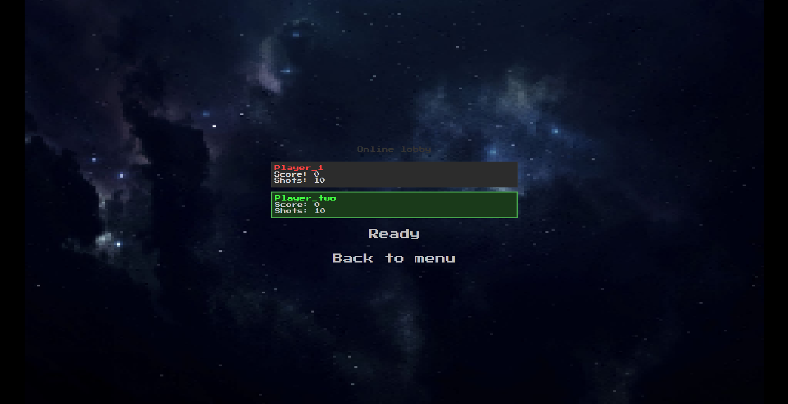
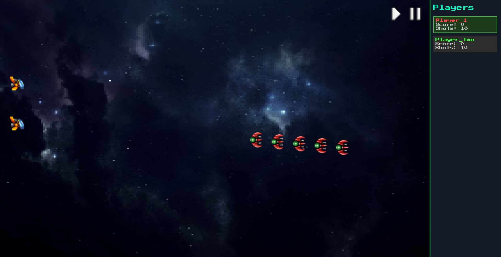

# Space Invaders Online

**Многопользовательская online-игра в жанре Space Invaders** с клиент-серверной архитектурой, поддержкой до 4 игроков, лобби, системой паузы и сохранением статистики в PostgreSQL.


---

## Скриншоты



 

---

## Возможности

- **Многопользовательская игра** – (2-4 игрока) по сети
- **Клиент-серверная архитектура** – на TCP-сокетах
- **Лобби с готовностью игроков** – игра запускается только когда все игроки готовы
- **Система паузы по голосованию** – игра приостанавливается, если все игроки нажали паузу
- **Игровой цикл с фиксированной частотой** (60 тиков/с) – независимость от FPS
- **Сохранение статистики** – PostgreSQL через Hibernate:
    - Имя
    - Победы
    - Количество выстрелов
    - Количество попаданий
- **Таблица лидеров** – топ-10 игроков по победам
- **Графический интерфейс** – JavaFX с кастомными стилями и спрайтами

---

## Технологический стек

| Компонент       | Технология                                  |
|-----------------|---------------------------------------------|
| Язык            | Java 21+                                    |
| Графика         | JavaFX 21                                   |
| Сеть            | Java Sockets (TCP), Gson                    |
| База данных     | PostgreSQL, Hibernate                       |
| Сборка          | Maven                                       |
| Многопоточность | Потоки для сети + JavaFX Application Thread |
| Контроль версий | Git                                         |

---

## Установка и запуск

### Требования
- JDK 21 (Intellij IDEA)
- Maven
- PostgreSQL

### 1. Клонирование репозитория

```bash
git clone https://github.com/Sanchert/Space-Invaders-Online.git
cd space-invaders-online
```

### 2. Настройка базы данных
Создайте базу данных PostgreSQL:

```sql
CREATE DATABASE space_invaders_db;
CREATE USER your_user WITH PASSWORD 'your_password';
GRANT ALL PRIVILEGES ON DATABASE space_invaders_db TO your_user;
```
Отредактируйте `src/main/resources/hibernate.cfg.xml`:

```xml
<property name="hibernate.connection.username">your_user</property>
<property name="hibernate.connection.password">your_password</property>
<property name="hibernate.connection.url">jdbc:postgresql://localhost:5432/space_invaders_db</property>
```
**Важно**: в учебных целях конфигурация лежит в репозитории. В реальных проектах используйте переменные окружения или `.env` файлы.

### 3. Игра
- Выберите онлайн игру
- Введите имя (уникальное для каждого игрока)
- Дождитесь подключения 2-4 игроков в лобби
- Нажмите Ready
- Управление:
  - `W` / `S` – движение вверх/вниз
  - `D` – выстрел
  - `ESC` – пауза (требуется голосование всех игроков)

### 4. Структура проекта
```text
src/main/java/org/example/space_invaders_online/
├── Launcher.java                     # Точка входа
├── game/
│   ├── client/                       # Клиентская часть
│   │   ├── GameApplication.java      # JavaFX приложение
│   │   ├── NetworkClient.java        # Работа с сокетами
│   │   ├── object/                   # Клиентские модели (Player, Bullet, Target)
│   │   └── ...
│   ├── server/                       # Серверная часть
│   │   ├── Server.java               # Главный сервер, лобби, игровой цикл
│   │   ├── ClientHandler.java        # Обработка одного клиента
│   │   ├── ServerTime.java           # Фиксированный timestep
│   │   └── ...
│   ├── database/                     # Работа с БД через Hibernate
│   │   ├── PlayerStats.java          # Entity
│   │   ├── PlayerStatsDAO_HB.java    # DAO слой
│   │   └── ...
│   ├── gameWorld/                    # Логика игрового мира
│   │   ├── GameWorld.java            # Управление объектами, коллизии
│   │   └── ...
│   └── sceneController/              # UI и навигация по экранам
│       ├── ScreenManager.java        # Переключение между Menu/Game
│       └── controllers/              # Контроллеры для FXML
└── resources/
    ├── fxml/                         # Интерфейсы (menu.fxml, game.fxml)
    ├── css/                          # Стили
    ├── images/                       # Спрайты и фон
    └── hibernate.cfg.xml             # Конфигурация БД
```

### 5. Особенности реализации
**Игровой цикл с фиксированным временем (`ServerTime.java`)**
- Собственная реализация fixed timestep (60 FPS логики)
- Поддержка паузы без сбоев синхронизации
- Накопление времени для стабильной симуляции

**Сетевая синхронизация**
- Сервер – авторитетный источник состояния игры
- Клиенты отправляют только действия (движение, выстрел)
- Состояние рассылается всем клиентам 60 раз в секунду в формате JSON

**Голосование за паузу**
- Каждый игрок может запросить паузу
- Пауза активируется только когда все игроки нажали паузу
- Снятие паузы – любой игрок может снять с паузы

**База данных**
- Hibernate автоматически создаёт таблицы (`hbm2ddl.auto=update`)
- Обработка конфликтов имён через `ON CONFLICT DO NOTHING`
- Топ-10 игроков по количеству побед
---

## Лицензия
Проект создан в учебных целях. Все спрайты и изображения принадлежат их законным владельцам.
- `https://ansimuz.itch.io/warped-space-shooter` – игровые спрайты
